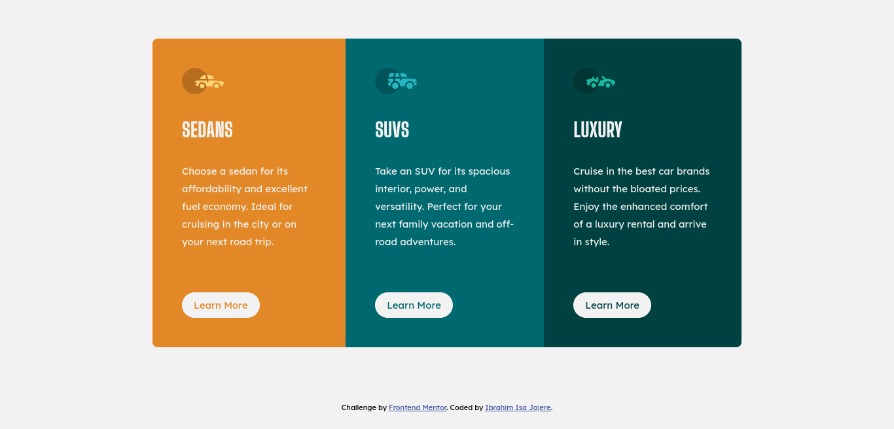
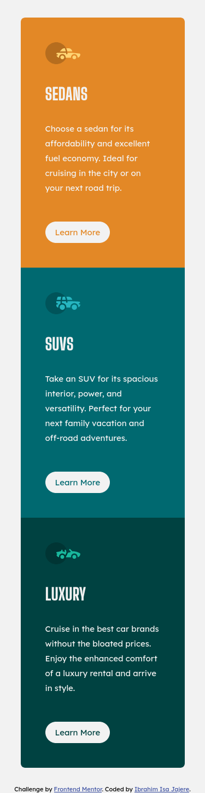

# Frontend Mentor - 3-column preview card component solution

This is a solution to the [3-column preview card component challenge on Frontend Mentor](https://www.frontendmentor.io/challenges/3column-preview-card-component-pH92eAR2-). Frontend Mentor challenges help you improve your coding skills by building realistic projects. 

## Table of contents

- [Overview](#overview)
  - [The challenge](#the-challenge)
  - [Screenshot](#screenshot)
  - [Links](#links)
- [My process](#my-process)
  - [Built with](#built-with)
  - [What I learned](#what-i-learned)
  - [Useful resources](#useful-resources)
- [Author](#author)

## Overview

### The challenge

Users should be able to:

- View the optimal layout depending on their device's screen size
- See hover states for interactive elements

### Screenshot

_**Desktop preview**_


_**Mobile preview**_



### Links

- Solution URL: [Add solution URL here](https://www.frontendmentor.io/challenges/3column-preview-card-component-pH92eAR2-/hub/responsive-3column-preview-card-component-using-flex-and-grid-gAv92HwIg)
- Live Site URL: [Add live site URL here](https://vibrant-shockley-38e111.netlify.app)

## My process

I started by coding the mobile version first and then added a few lines of media query for the desktop version.

### Built with

- Flexbox
- CSS Grid
- Mobile-first workflow

### What I learned

- I learned how to add font face from an external file  
  ```css
    @font-face {
      font-family: customName;
      src: url(./location/font.ttf);
  }
  ```
- I also learned sass variables  
  ```scss
  $color: hsl(0, 0%, 95%);
  ```
- And here is some css i am proud of  
  ```css
  display: grid;
  place-items: center;
  ```

### Useful resources

- [CSS units](https://blog.devgenius.io/a-bite-sized-best-practices-guide-for-css-units-em-rem-px-and-more-f621c0d56df4) - This helped me for learning css relative units. Hence i will use it going forward.

## Author

- Frontend Mentor - [@yourusername](https://www.frontendmentor.io/profile/ibraimisa)
- Twitter - [@yourusername](https://www.twitter.com/Ibrahim_Isa274)
